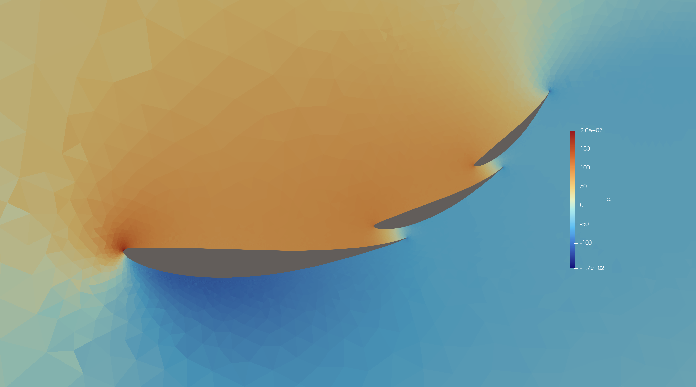

# 2D-Multi-Element-Aerofoil-Mesh-Generator

A Python-based mesh generator that uses [Gmsh](https://gmsh.info/) to build 2D CFD grids for multi-element wings (e.g. main element + flap/slat combinations), driven entirely by simple TOML config files. Meshes are exported in a UNV2 format specifically post-processed for direct compatibility with the [XCALibre.jl](https://github.com/mberto79/XCALibre.jl) finite volume CFD solver, and the repo includes example Julia scripts for running RANS cases on the generated grids.

## Features / Capabilities

### Mesh Output Formats

Currently only supports modified .unv outputs intended for use with the XCALibre.jl CFD solver. Generic .unv and OpenFOAM coming soon.

### Mesher (`03_Meshing_Script`)

- **Multi-element geometry** — any number of aerofoil elements per case, each with its own Selig-format `.dat` coordinate file, chord, `(x, y)` position, angle of attack and (optional) blunt trailing-edge thickness.
- **Config-driven** — every case is defined in a single TOML file (see [`02_Mesh_Input_File`](02_Mesh_Input_File)); no code edits needed for standard runs.
- **Boundary layer (inflation) meshing** — configurable first-layer height, growth rate and total thickness, with automatic fanning around blunt trailing-edge corners.
- **Wake refinement** — an AOA-scaled refinement box generated per element, sized and oriented to capture each element's own shed wake.
- **Curvature-based refinement** — cell size adapts to local surface curvature (e.g. leading edges).
- **XCALibre-ready export** — writes a `.unv` mesh with the Fortran exponent, boundary-group dataset, and node/element numbering fixes required for [XCALibre.jl](https://github.com/mberto79/XCALibre.jl) to read it correctly.
- **Interactive preview** — the generated mesh opens automatically in the Gmsh GUI for inspection.

### CFD Scripts (`05_CFD_Scripts`)

Example [XCALibre.jl](https://github.com/mberto79/XCALibre.jl) run scripts for meshes produced by this repo:

- Steady, incompressible RANS via XCALibre's `Physics`/`Configuration` model.
- Two turbulence closures demonstrated: **k-ω** and **k-ω SST**, with wall functions on the airfoil boundary and a symmetry condition on the farfield.
- Boundary conditions matched directly to the physical groups written by the mesher (`inlet`, `outlet`, `airfoil`, `farfield`).
- Per-field solver configuration (Bicgstab/CG, Jacobi preconditioning, relaxation factors, convergence tolerances).
- CPU multithreaded execution via XCALibre's hardware backend (the same scripts can be retargeted to GPU backends supported by XCALibre).

See the [XCALibre.jl repository](https://github.com/mberto79/XCALibre.jl) for full solver documentation.

## File / Folder Structure and Workflow

| Folder | Contents |
|---|---|
| [`01_Foils`](01_Foils) | Raw aerofoil coordinates (Selig format, one `.dat` per aerofoil) used to build each element. |
| [`02_Mesh_Input_File`](02_Mesh_Input_File) | Per-case TOML files: element geometry (chord, position, AOA, TE thickness), farfield extents, and all mesh refinement settings. |
| [`03_Meshing_Script`](03_Meshing_Script) | `RUN_SCRIPT.py` is used to make the mesh plus various modules containing meshing functions. |
| [`04_Meshes`](04_Meshes) | Output `.unv` mesh files, named after each TOML file's `title`. |
| [`05_CFD_Scripts`](05_CFD_Scripts) | Example Julia scripts that load a mesh from `04_Meshes` and run a case in XCALibre.jl. |

### Workflow

1. Add/confirm your aerofoil coordinate file(s) in `01_Foils` (Selig `.dat` format).
2. Create or edit a case file in `02_Mesh_Input_File` (copy `2_el_wing.toml` or `3_el_wing.toml` as a starting point) — set each element's chord, position, AOA and TE thickness, the farfield box, and the refinement/boundary-layer/wake settings.
3. Run the mesher, pointing it at your config file:
   ```
   python RUN_SCRIPT.py ../02_Mesh_Input_File/your_case.toml
   ```
   (run from inside `03_Meshing_Script`; omitting the argument defaults to `2_el_wing.toml`). The mesh is written to `04_Meshes/<title>.unv` and the Gmsh GUI opens automatically so you can inspect it.
4. Point a Julia script in `05_CFD_Scripts` at your new `.unv` file and run it to solve the flow with XCALibre.jl.

## Pre-requisites

- **[Python](https://www.python.org/)** 3.9+, with:
  - [`gmsh`](https://pypi.org/project/gmsh/)
  - [`toml`](https://pypi.org/project/toml/)
  ```
  pip install gmsh toml
  ```
- **[Gmsh](https://gmsh.info/)** — installed automatically via the `gmsh` Python package above (no separate install needed).
- **[Julia](https://julialang.org/)** 1.10+, with:
  - [`XCALibre.jl`](https://github.com/mberto79/XCALibre.jl)
  - [`Plots.jl`](https://github.com/JuliaPlots/Plots.jl)
  ```julia
  using Pkg
  Pkg.add(["XCALibre", "Plots"])
  ```

## Examples

### 2-element wing


### 3-element wing


### CFD results


